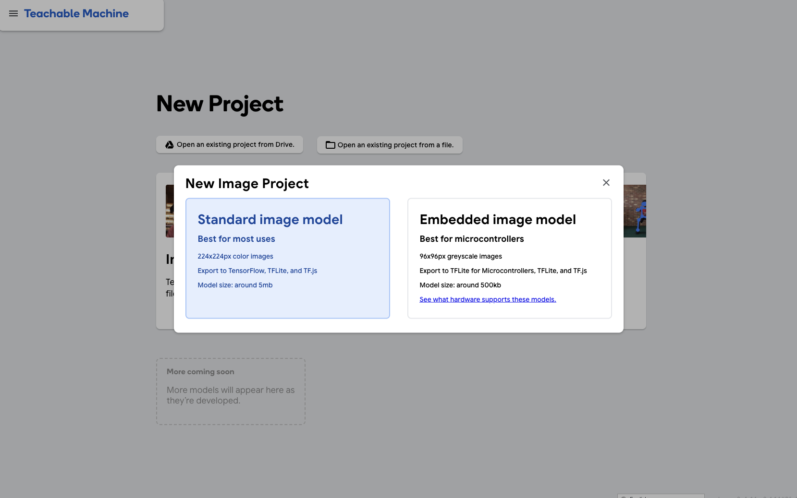
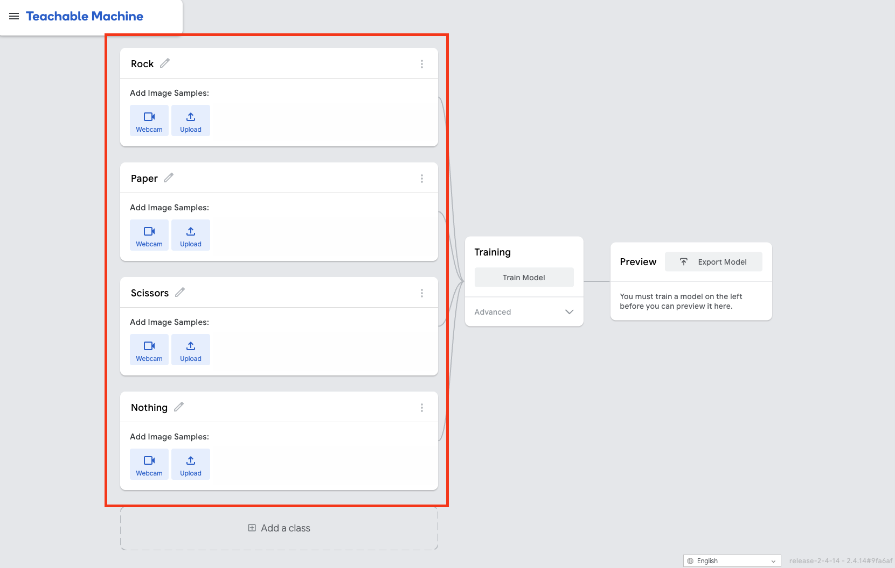
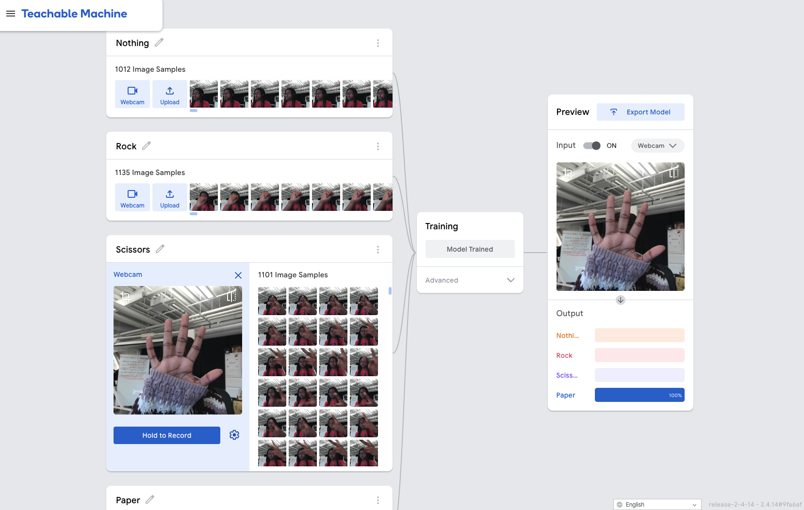
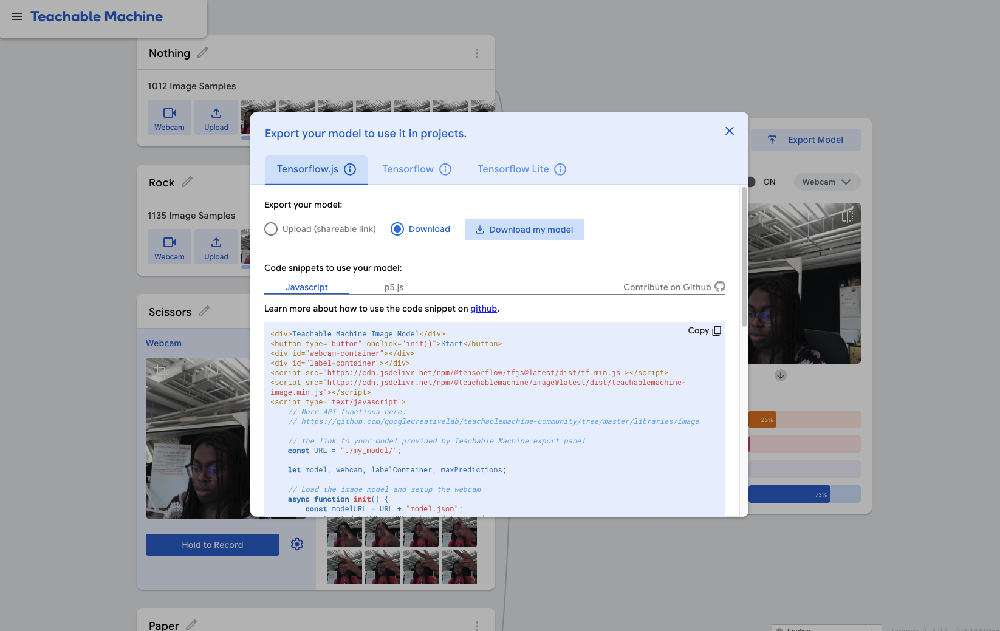

# ✊ Rock Paper Scissors Pt 1

<p style="color:#6ee7b7;"><strong>Goal:</strong> Train your own Teachable Machine model, then build a webcam page that shows a live confidence bar for four classes: Rock, Paper, Scissors, and Nothing.</p>

<p style="color:#facc15;"><strong>⚠️ Before you begin:</strong> keep your Teachable Machine tab open in the browser for this entire project. If you close it, reopening the project link later gives you an empty or read-only copy - not something you can add more samples to or retrain. Leaving the tab open means you can always go back and fine-tune your model later. At the end of the day, you can also upload your model to Google Drive and come back to it later.</p>

<details open>
<summary><strong>🗺️ Big Picture</strong></summary>

By the end of this project, you'll be able to play Rock Paper Scissors with your webcam against a CPU in your browser by holding up the "Rock," "Paper," and "Scissors" hand signs to your camera.

The project has three main parts:

1. Train an image model in Teachable Machine and export it.
2. Build the HTML page structure and style the page with CSS.
3. Write the JavaScript that loads your model and uses it to detect Rock, Paper, and Scissors!

</details>

## Training Your Model

<details open>
<summary><strong>🧠 <span style="color:#60a5fa;">Step 1: Create A New Image Project</span></strong></summary>

Go to [teachablemachine.withgoogle.com/train/image](https://teachablemachine.withgoogle.com/train/image) and choose **Image Project**, then **Standard image model**.



</details>

<details>
<summary><strong>🏷️ <span style="color:#f472b6;">Step 2: Set Up Your Four Classes</span></strong></summary>

You'll land on a screen with two class panels (`Class 1`, `Class 2`). Click each name to rename it, and use **Add a class** to add two more, so you end up with exactly these four, in this order:

```
Rock
Paper
Scissors
Nothing
```



<p style="color:#fbbf24;"><strong>💡 Here's why we need a "Nothing" class:</strong> a classifier's confidence scores always add up to 100% across whatever classes it has. If you only train Rock/Paper/Scissors, the model is forced to call <em>every single frame</em> one of those three, even if it's empty, because there's no fourth option for it to fall back on. Adding Nothing gives it somewhere honest to put its confidence when you aren't throwing a RPS move.</p>

</details>

<details>
<summary><strong>📸 <span style="color:#34d399;">Step 3: Record Samples For Rock, Paper, And Scissors</span></strong></summary>

Under each class panel, click the webcam icon, then hold the **"Hold to Record"** button to capture a burst of frames while you hold that gesture in front of your camera.

Aim for at least 100-200 samples per class. More importantly than the count, vary *how* you show the gesture between recording bursts:

- **Distance** - close to the camera, then further back
- **Angle** - hand facing the camera straight-on, then rotated or tilted
- **Position in frame** - centered, then off to one side, then near a corner

<p style="color:#a78bfa;"><strong>✨ Design note:</strong> do several short recordings per class instead of one long hold in the same spot - that's what actually creates the variety above.</p>

</details>

<details>
<summary><strong>🪑 <span style="color:#38bdf8;">Step 4: Record Samples For "Nothing"</span></strong></summary>

Repeat the same process for the `Nothing` class - but instead of a gesture, capture frames of whatever the camera sees when you **aren't** making a move.

<!--  -->

<p style="color:#f87171;"><strong>🚨 Common mistake:</strong> if every "Nothing" sample looks like one thing in one specific lighting condition, the class only works in that exact condition. Don't forget to give it the same distance/angle/lighting variety as Step 3.</p>

</details>

<details>
<summary><strong>🏋️ <span style="color:#fb7185;">Step 5: Train The Model</span></strong></summary>

Once all four classes have samples, click **Train Model** in the middle column.

Training runs entirely in your browser, but don't leave the tab! It usually takes anywhere from 30 seconds to a couple of minutes. Leave the **Advanced** settings (epochs, batch size, learning rate) at their defaults for now.

</details>

<details>
<summary><strong>🔍 <span style="color:#c084fc;">Step 6: Test It Live, Before Writing Any Code</span></strong></summary>

Once training finishes, the **Preview** panel on the right turns on your webcam and shows live confidence bars right inside Teachable Machine. Here's where you can test and refine your model before exporting!



<p style="color:#93c5fd;"><strong>Note:</strong> this step isolates one variable at a time. If a class doesn't work here, the problem is your training data (back to Step 3 or 4) because no code exists yet. If it works here but is wonky later once you've built your own page, you'll know the problem is probably in your JavaScript instead.</p>

</details>

<details>
<summary><strong>📦 <span style="color:#22c55e;">Step 7: Export Your Model</span></strong></summary>

Click **Export Model**, switch to the **Tensorflow.js** tab, choose **Download** (not "Upload (shareable link)" - this project loads the model from your own files, not a URL), then click **Download my model**.



This downloads a `.zip` file. Unzip it (on Mac, you can click on it to open it in Finder) - you'll get `model.json`, `metadata.json`, and one or more weight files (`weights.bin`, or `weights.bin` split into numbered shards - either is fine).

</details>

<details>
<summary><strong>🗂️ <span style="color:#facc15;">Step 8: Set Up Your Project Folder</span></strong></summary>

Make a new folder wherever you keep code - call it something like `rps-confidence-monitor` - and open it in VS Code. Inside it, create three empty files (`index.html`, `style.css`, `script.js`), plus a `model` folder containing the files you exported in Step 7, so it looks like this:

```
rps-confidence-monitor/
  index.html
  style.css
  script.js
  model/
    model.json
    metadata.json
    weights.bin
```

<p style="color:#fbbf24;"><strong>💡 Why this matters:</strong> the folder name and file names here need to match exactly what you'll type in <code>script.js</code> in Step 15 - if you rename this folder, use the new name there too.</p>

</details>

## Building The Website

<details>
<summary><strong>🧱 <span style="color:#2dd4bf;">Step 9: Start With HTML</span></strong></summary>

Open `index.html`. If you're using VS Code, you can type `html:5` and press Enter to create a basic HTML page. Yours should start like this:

```html
<!doctype html>
<html lang="en">
  <head>
    <meta charset="UTF-8" />
    <meta name="viewport" content="width=device-width, initial-scale=1.0" />
    <title>Part 1 - Confidence Monitor</title>
  </head>
  <body>

  </body>
</html>
```

<p style="color:#fbbf24;"><strong>Note:</strong> this page doesn't draw anything yet - we still need fonts, styles, the model libraries, and our own script.</p>

</details>

<details>
<summary><strong>🔤 <span style="color:#818cf8;">Step 10: Add Your Fonts And Stylesheet</span></strong></summary>

Inside `<head>`, after `<title>`, add:

```html
<!doctype html>
<html lang="en">
<head>
    <meta charset="UTF-8" />
    <meta name="viewport" content="width=device-width, initial-scale=1.0" />
    <title>Part 1 - Confidence Monitor</title>
    <!-- new lines ⬇️ -->
    <link rel="preconnect" href="https://fonts.googleapis.com" />
    <link
      href="https://fonts.googleapis.com/css2?family=Epilogue:wght@400;500;600&family=Instrument+Sans:wght@600;700&display=swap"
      rel="stylesheet"
    />
    <link rel="stylesheet" href="style.css" />
    <!-- new lines ⬆️ -->
</head>
<body>

</body>
</html>
```

The first two links load two font families from Google Fonts - Epilogue and Instrument Sans - that `style.css` will use. The last link connects the page to your `style.css` file, which is where we'll be storing all of our styling to make it beautiful!

</details>

<details>
<summary><strong>🤖 <span style="color:#fb923c;">Step 11: Load TensorFlow.js And Teachable Machine</span></strong></summary>

Still inside `<head>`, right after the stylesheet link:

```html
<head>
    ...
    <link rel="stylesheet" href="style.css" />
    <!-- new lines ⬇️ -->
    <script src="https://cdn.jsdelivr.net/npm/@tensorflow/tfjs@4.20.0/dist/tf.min.js"></script>
    <script src="https://cdn.jsdelivr.net/npm/@teachablemachine/image@0.8.5/dist/teachablemachine-image.min.js"></script>
    <!-- new lines ⬆️ -->
</head>
```

These download Google's machine-learning libraries and define two variables we can use in our custom code - `tf` and `tmImage` - that `script.js` will use later.

<p style="color:#f87171;"><strong>🚨 Common bug:</strong> these need to load <em>before</em> your own script. That's why they belong up here in <code>&lt;head&gt;</code>, loaded first, rather than at the bottom of the page.</p>

</details>

<details>
<summary><strong>🎥 <span style="color:#f472b6;">Step 12: Add The Webcam Viewfinder</span></strong></summary>

Inside `<body>`, add:

```html
<body>
    <!-- new lines ⬇️ -->
    <main class="page">
      <div class="viewfinder">
        <video id="webcam" autoplay muted playsinline></video>
      </div>
    </main>
    <!-- new lines ⬆️ -->
</body>
```

The `<video id="webcam">` is where the live camera feed displays - `script.js` will find it by that `id` and attach the camera stream to it. `autoplay muted playsinline` are required so the browser plays the video automatically instead of waiting for a click (autoplaying video with sound is blocked by default, hence `muted`).

Now switch to `style.css` and add:

```css
:root {
  --ink: #16161d;
  --panel: #1f1f29;
  --well: #262632;
  --line: #33333f;
  --paper: #edebf6;
  --muted: #9c99ae;
  --mint: #a7e3c9;
  --lavender: #c9b9ee;
}

* {
  box-sizing: border-box;
}

body {
  margin: 0;
  background: var(--ink);
  color: var(--paper);
  font-family: "Epilogue", system-ui, sans-serif;
}

.page {
  max-width: 560px;
  margin: 0 auto;
  padding: 48px 24px;
  text-align: center;
}

.viewfinder {
  position: relative;
  width: 100%;
  aspect-ratio: 4 / 3;
  border-radius: 16px;
  overflow: hidden;
  background: #000;
  border: 1px solid var(--line);
}

.viewfinder video {
  width: 100%;
  height: 100%;
  object-fit: cover;
  transform: scaleX(-1);
}
```

The `:root` block declares color variables once, reused everywhere with `var(--name)` - change a theme color in one place instead of hunting through every rule. `box-sizing: border-box` makes padding count inside an element's declared width instead of adding to it. `.page` centers and caps the content at 560px so it doesn't stretch uncomfortably wide. `aspect-ratio: 4 / 3` keeps the frame a consistent shape no matter the camera's actual resolution, and `object-fit: cover` fills the frame without distorting the image.

<p style="color:#fbbf24;"><strong>💡 Mirror fix:</strong> <code>transform: scaleX(-1)</code> flips the video horizontally. Without it, raising your right hand would appear on the left side of the frame - mirroring it makes the feed behave like an actual mirror.</p>

</details>

<details>
<summary><strong>📊 <span style="color:#34d399;">Step 13: Add The Confidence Bars And Status Line</span></strong></summary>

Right after the `.viewfinder` div:

```html
<div class="viewfinder">
  ...
</div>

<!-- new lines ⬇️ -->
<!-- One .bar-row per class gets created here by script.js -
     don't hand-write them, renderConfidenceBars() builds them. -->
<div id="confidence-bars" class="confidence-bars"></div>
<p id="status" class="status">Loading model…</p>
<!-- new lines ⬆️ -->
```

`#confidence-bars` starts completely empty on purpose - `script.js` will build one bar row inside it per class in Step 18. `#status` is a small line that shows what's currently happening, so you always know the current state instead of staring at a blank screen.

Now the CSS:

```css
.confidence-bars {
  margin-top: 20px;
  display: flex;
  flex-direction: column;
  gap: 8px;
  text-align: left;
}

.bar-row {
  display: flex;
  align-items: center;
  gap: 10px;
  font-size: 0.8rem;
}

.bar-label {
  width: 84px;
  flex-shrink: 0;
  color: var(--muted);
  white-space: nowrap;
  overflow: hidden;
  text-overflow: ellipsis;
}

.bar-track {
  flex: 1;
  height: 8px;
  border-radius: 999px;
  background: var(--well);
  overflow: hidden;
}

.bar-fill {
  height: 100%;
  display: block;
  border-radius: 999px;
  background: var(--mint);
  width: 0%;
  transition: width 120ms linear;
}

.bar-value {
  width: 40px;
  flex-shrink: 0;
  text-align: right;
  color: var(--paper);
}

.status {
  margin-top: 16px;
  font-size: 0.8rem;
  color: var(--muted);
}
```

<p style="color:#a78bfa;"><strong>✨ Design note:</strong> none of these classes (<code>.bar-row</code>, <code>.bar-label</code>, etc.) exist in your HTML yet - <code>script.js</code> creates them at runtime in Step 18. This CSS is written ahead of time for elements that don't exist until the page actually runs.</p>

</details>

<details>
<summary><strong>🔌 <span style="color:#38bdf8;">Step 14: Import Your Script</span></strong></summary>

Close out `<main>`, then add your script tag as the very last thing before `</body>`:

```html
    </main>

    <!-- new line ⬇️ -->
    <script src="script.js"></script>
    <!-- new line ⬆️ -->
  </body>
</html>
```

<p style="color:#f87171;"><strong>🚨 Common bug:</strong> this has to go at the <em>end</em> of <code>&lt;body&gt;</code>, not up in <code>&lt;head&gt;</code>. Your script calls <code>document.getElementById(...)</code> the moment it runs - if it loaded before the elements above existed, it would find nothing.</p>

</details>

## Coding Your Webcam

<details>
<summary><strong>📄 <span style="color:#fb7185;">Step 15: Create Your JavaScript File</span></strong></summary>

Create - or open - `script.js`. At the top, add:

```js
const MODEL_URL = "./model/model.json";
const METADATA_URL = "./model/metadata.json";

const videoEl = document.getElementById("webcam");
const barsContainer = document.getElementById("confidence-bars");
const statusEl = document.getElementById("status");

let model = null;
```

`MODEL_URL`/`METADATA_URL` point at the files from Step 8. `document.getElementById(...)` finds the elements from Steps 12-13 by their `id` attributes, so your code can read from or write to them - `videoEl` is how you'll attach the camera stream, `barsContainer` is where you'll insert bar rows, `statusEl` is what you'll update with progress messages.

<p style="color:#fbbf24;"><strong>💡 Why <code>null</code>?</strong> <code>model</code> starts as <code>null</code> because nothing's loaded yet - you'll assign the real model to it in Step 17.</p>

</details>

<details>
<summary><strong>📷 <span style="color:#c084fc;">Step 16: Start The Webcam</span></strong></summary>

```js
async function startWebcam() {
  const stream = await navigator.mediaDevices.getUserMedia({
    video: { facingMode: "user", width: 480, height: 360 },
    audio: false
  });
  videoEl.srcObject = stream;
  await new Promise((resolve) => {
    videoEl.onloadedmetadata = resolve;
  });
  await videoEl.play();
}
```

`navigator.mediaDevices.getUserMedia(...)` is the browser API that asks the user for camera permission and hands back a live video `stream` if they allow it. `facingMode: "user"` requests the front-facing camera. Setting `videoEl.srcObject = stream` connects that stream to the `<video>` element from Step 12.

<p style="color:#93c5fd;"><strong>🔄 What's happening:</strong> the <code>Promise</code> waiting on <code>onloadedmetadata</code> makes sure the video has real dimensions before calling <code>.play()</code> - skipping that can make <code>.play()</code> fail silently in some browsers.</p>

</details>

<details>
<summary><strong>🧠 <span style="color:#22c55e;">Step 17: Load The Model</span></strong></summary>

```js
async function loadModel() {
  model = await tmImage.load(MODEL_URL, METADATA_URL);
}
```

`tmImage.load(modelURL, metadataURL)` is provided by the library loaded in Step 11. It fetches your model files and builds a ready-to-use model object, stored in the `model` variable from Step 15.

<p style="color:#fbbf24;"><strong>💡 Why <code>async</code>/<code>await</code>?</strong> Loading model files takes time - your code pauses here until it's done rather than moving on with an unfinished model.</p>

</details>

<details>
<summary><strong>📶 <span style="color:#4ade80;">Step 18: Turn Predictions Into Bar Rows</span></strong></summary>

```js
function renderConfidenceBars(predictions) {
  if (barsContainer.children.length === 0) {
    for (const p of predictions) {
      const row = document.createElement("div");
      row.className = "bar-row";
      row.dataset.className = p.className;
      row.innerHTML = `
        <span class="bar-label">${p.className}</span>
        <span class="bar-track"><span class="bar-fill"></span></span>
        <span class="bar-value">0%</span>
      `;
      barsContainer.appendChild(row);
    }
  }

  for (const p of predictions) {
    const row = barsContainer.querySelector(`[data-class-name="${p.className}"]`);
    if (!row) continue;
    const pct = Math.round(p.probability * 100);
    row.querySelector(".bar-fill").style.width = pct + "%";
    row.querySelector(".bar-value").textContent = pct + "%";
  }
}
```

This takes the array of predictions your model produces - one entry per class, each with a `className` and a `probability` from 0-1 - and turns it into the bars styled in Step 13. The first block runs only once, the first time it notices `barsContainer` is empty, and builds one `.bar-row` per class, tagging each with `data-class-name` so it can be found again. The second block runs every time and just updates the width/text of the existing bars.

<p style="color:#86efac;"><strong>🎯 Result:</strong> the bars resize smoothly instead of flickering as they'd be recreated 30+ times a second.</p>

</details>

<details>
<summary><strong>🔁 <span style="color:#facc15;">Step 19: Classify The Webcam Feed, Continuously</span></strong></summary>

```js
async function predictionLoop() {
  const predictions = await model.predict(videoEl);
  renderConfidenceBars(predictions);
  requestAnimationFrame(predictionLoop);
}
```

`model.predict(videoEl)` runs your model on the *current* video frame and returns an array like `[{ className: "Rock", probability: 0.83 }, ...]`. That array is handed to `renderConfidenceBars` from Step 18.

<p style="color:#93c5fd;"><strong>🔄 What's happening:</strong> the last line, <code>requestAnimationFrame(predictionLoop)</code>, schedules this same function to run again right before the browser's next repaint - which is what makes this a continuous loop rather than a single check. Each call re-triggers the next one, so once it starts, it keeps going on its own.</p>

</details>

<details>
<summary><strong>🚀 <span style="color:#2dd4bf;">Step 20: Tie It Together And Start Everything</span></strong></summary>

```js
async function init() {
  try {
    statusEl.textContent = "Loading model…";
    await loadModel();

    statusEl.textContent = "Requesting webcam…";
    await startWebcam();

    statusEl.textContent = "Live";
    predictionLoop();
  } catch (err) {
    console.error(err);
    statusEl.textContent = "Something's not wired up yet - check the console.";
  }
}

init();
```

`init()` runs the two setup steps in order - model first, then webcam - updating `#status` so you always know what stage you're at. It's wrapped in `try/catch` so a failure (camera permission denied, wrong file path) shows a clear message instead of silently breaking.

<p style="color:#a78bfa;"><strong>✨ Design note:</strong> <code>predictionLoop()</code> is called once at the end, without <code>await</code>, because it keeps rescheduling itself from here on - nothing after it needs to wait for it to "finish," since it never does. The final line, <code>init();</code>, actually kicks all of this off the moment the page loads.</p>

</details>

## Full Solution

If you get stuck, here's the complete, working version of all three files.

<details>
<summary><strong>✅ <span style="color:#6ee7b7;">Complete index.html</span></strong></summary>

```html
<!doctype html>
<html lang="en">
  <head>
    <meta charset="UTF-8" />
    <meta name="viewport" content="width=device-width, initial-scale=1.0" />
    <title>Part 1 - Confidence Monitor</title>

    <link rel="preconnect" href="https://fonts.googleapis.com" />
    <link
      href="https://fonts.googleapis.com/css2?family=Epilogue:wght@400;500;600&family=Instrument+Sans:wght@600;700&display=swap"
      rel="stylesheet"
    />
    <link rel="stylesheet" href="style.css" />

    <!-- Teachable Machine + TensorFlow.js, loaded from a CDN.
         These give you two globals to use in script.js: tf and tmImage -->
    <script src="https://cdn.jsdelivr.net/npm/@tensorflow/tfjs@4.20.0/dist/tf.min.js"></script>
    <script src="https://cdn.jsdelivr.net/npm/@teachablemachine/image@0.8.5/dist/teachablemachine-image.min.js"></script>
  </head>
  <body>
    <main class="page">
      <div class="viewfinder">
        <video id="webcam" autoplay muted playsinline></video>
      </div>

      <!-- One .bar-row per class gets created here by script.js -
           don't hand-write them, renderConfidenceBars() builds them. -->
      <div id="confidence-bars" class="confidence-bars"></div>

      <p id="status" class="status">Loading model…</p>
    </main>

    <script src="script.js"></script>
  </body>
</html>
```

</details>

<details>
<summary><strong>✅ <span style="color:#6ee7b7;">Complete style.css</span></strong></summary>

```css
:root {
  --ink: #16161d;
  --panel: #1f1f29;
  --well: #262632;
  --line: #33333f;
  --paper: #edebf6;
  --muted: #9c99ae;
  --mint: #a7e3c9;
  --lavender: #c9b9ee;
}

* {
  box-sizing: border-box;
}

body {
  margin: 0;
  background: var(--ink);
  color: var(--paper);
  font-family: "Epilogue", system-ui, sans-serif;
}

.page {
  max-width: 560px;
  margin: 0 auto;
  padding: 48px 24px;
  text-align: center;
}

.viewfinder {
  position: relative;
  width: 100%;
  aspect-ratio: 4 / 3;
  border-radius: 16px;
  overflow: hidden;
  background: #000;
  border: 1px solid var(--line);
}

.viewfinder video {
  width: 100%;
  height: 100%;
  object-fit: cover;
  transform: scaleX(-1);
}

.confidence-bars {
  margin-top: 20px;
  display: flex;
  flex-direction: column;
  gap: 8px;
  text-align: left;
}

.bar-row {
  display: flex;
  align-items: center;
  gap: 10px;
  font-size: 0.8rem;
}

.bar-label {
  width: 84px;
  flex-shrink: 0;
  color: var(--muted);
  white-space: nowrap;
  overflow: hidden;
  text-overflow: ellipsis;
}

.bar-track {
  flex: 1;
  height: 8px;
  border-radius: 999px;
  background: var(--well);
  overflow: hidden;
}

.bar-fill {
  height: 100%;
  display: block;
  border-radius: 999px;
  background: var(--mint);
  width: 0%;
  transition: width 120ms linear;
}

.bar-value {
  width: 40px;
  flex-shrink: 0;
  text-align: right;
  color: var(--paper);
}

.status {
  margin-top: 16px;
  font-size: 0.8rem;
  color: var(--muted);
}
```

</details>

<details>
<summary><strong>✅ <span style="color:#6ee7b7;">Complete script.js</span></strong></summary>

```js
const MODEL_URL = "./model/model.json";
const METADATA_URL = "./model/metadata.json";

const videoEl = document.getElementById("webcam");
const barsContainer = document.getElementById("confidence-bars");
const statusEl = document.getElementById("status");

let model = null;

async function startWebcam() {
  const stream = await navigator.mediaDevices.getUserMedia({
    video: { facingMode: "user", width: 480, height: 360 },
    audio: false
  });
  videoEl.srcObject = stream;
  await new Promise((resolve) => {
    videoEl.onloadedmetadata = resolve;
  });
  await videoEl.play();
}

async function loadModel() {
  model = await tmImage.load(MODEL_URL, METADATA_URL);
}

async function predictionLoop() {
  const predictions = await model.predict(videoEl);
  renderConfidenceBars(predictions);
  requestAnimationFrame(predictionLoop);
}

function renderConfidenceBars(predictions) {
  if (barsContainer.children.length === 0) {
    for (const p of predictions) {
      const row = document.createElement("div");
      row.className = "bar-row";
      row.dataset.className = p.className;
      row.innerHTML = `
        <span class="bar-label">${p.className}</span>
        <span class="bar-track"><span class="bar-fill"></span></span>
        <span class="bar-value">0%</span>
      `;
      barsContainer.appendChild(row);
    }
  }

  for (const p of predictions) {
    const row = barsContainer.querySelector(`[data-class-name="${p.className}"]`);
    if (!row) continue;
    const pct = Math.round(p.probability * 100);
    row.querySelector(".bar-fill").style.width = pct + "%";
    row.querySelector(".bar-value").textContent = pct + "%";
  }
}

async function init() {
  try {
    statusEl.textContent = "Loading model…";
    await loadModel();

    statusEl.textContent = "Requesting webcam…";
    await startWebcam();

    statusEl.textContent = "Live";
    predictionLoop();
  } catch (err) {
    console.error(err);
    statusEl.textContent = "Something's not wired up yet - check the console.";
  }
}

init();
```

</details>

<details>
<summary><strong>🧩 <span style="color:#f0abfc;">What The Predict-Render-Loop Cycle Is Doing</span></strong></summary>

Three functions work together to keep the bars live:

```js
async function predictionLoop() {
```

This function classifies one frame, then reschedules itself.

```js
const predictions = await model.predict(videoEl);
```

This asks the model: "what do you see in the video *right now*?"

```js
renderConfidenceBars(predictions);
```

This turns that answer into bar widths on screen.

```js
requestAnimationFrame(predictionLoop);
```

This is the part that makes it a loop - it tells the browser "call `predictionLoop` again right before you next redraw the screen." Since `predictionLoop` calls this on itself every time it runs, it keeps going indefinitely once `init()` starts it in Step 20.

So the cycle is saying:

1. Look at the current video frame.
2. Guess what it is.
3. Draw that guess as bars.
4. Do it all again next frame.

<p style="color:#86efac;"><strong>🎯 Result:</strong> the bars update live as you move your hand, without you ever calling <code>predictionLoop</code> more than once yourself.</p>

</details>

## Before You Move On

<details open>
<summary><strong>⚠️ <span style="color:#facc15;">Check That Your Model Is Classifying Correctly</span></strong></summary>

Hold up each sign to the camera, Rock, Paper and Scissors, and make sure the sign is detected at at least 70% consistently.

If a class won't cooperate, that's likely an issue with your training-data. Go back to Steps 3-4 (your Teachable Machine tab is still open, right?), add more (and more varied) samples, retrain, re-export, and swap the new files into `model/`.

If you see a blank page or nothing loads, check that `index.html` loads the scripts in this order:

```html
<script src="https://cdn.jsdelivr.net/npm/@tensorflow/tfjs@4.20.0/dist/tf.min.js"></script>
<script src="https://cdn.jsdelivr.net/npm/@teachablemachine/image@0.8.5/dist/teachablemachine-image.min.js"></script>
<script src="script.js"></script>
```

<p style="color:#a78bfa;"><strong>✨ Extra challenge, if you have time:</strong> hand your laptop to a friend and see if your model recognizes <em>their</em> hand just as well as yours. If it struggles - different hand size, skin tone, or way of making a fist - that's a great excuse to hop back into your still-open Teachable Machine tab, add samples of their hand to each class, retrain, and re-export. A model that only works on the person who trained it is a good thing to notice now, before Part 2.</p>

</details>

<br>

<div align="center">
<sub><span style="color:#9c99ae;">Built with ✊ ✋ ✌️ and a webcam.</span></sub>
</div>